# 🧾 Evidencia de Manejo de Errores en Controllers

Este documento presenta la evidencia de los cambios aplicados a los controllers `LibrosController`, `PrestamosController` y `UsuariosController`, enfocándose en cómo se gestionaban los errores **antes** y **después** de aplicar un adecuado manejo mediante `try-catch`, códigos de estado y respuestas claras, además de mejorar significativamente el contenido de las mismas entidades evidenciando el progreso que ha tenido el proyecto.

> 📁 **Nota:** Las capturas fueron tomadas directamente del código fuente, no del Swagger.

---

## 📂 Comparacion en LibrosController

### 1. `GET` — Obtener todos

- **Antes del manejo de errores:**
  
  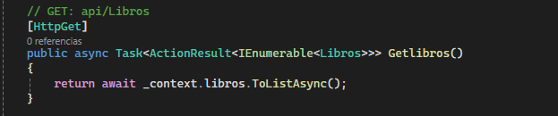

- **Después del manejo de errores:**
  
  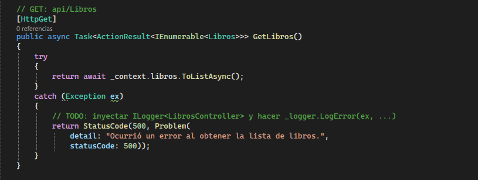

---

### 2. `GET {id}` — Obtener por ID

- **Antes del manejo de errores:**
  
  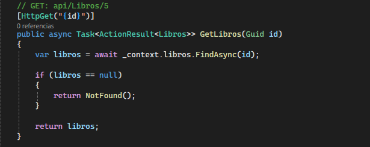

- **Después del manejo de errores:**
  
  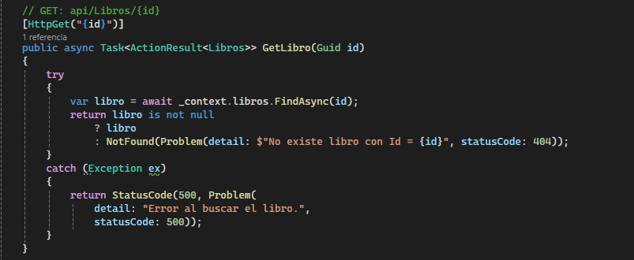

---

### 3. `POST` — Crear nuevo

- **Antes del manejo de errores:**
  
  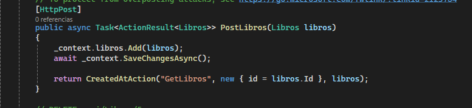

- **Después del manejo de errores:**
  
  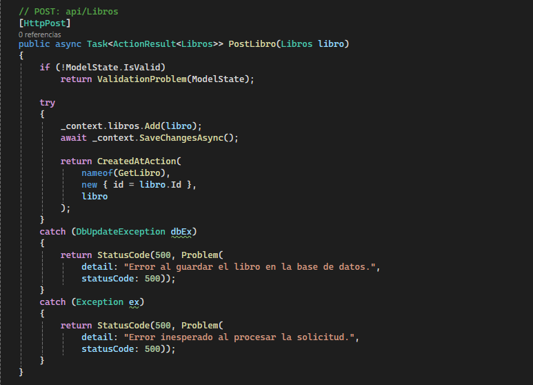

---

### 4. `PUT {id}` — Modificar

- **Antes del manejo de errores:**
  
  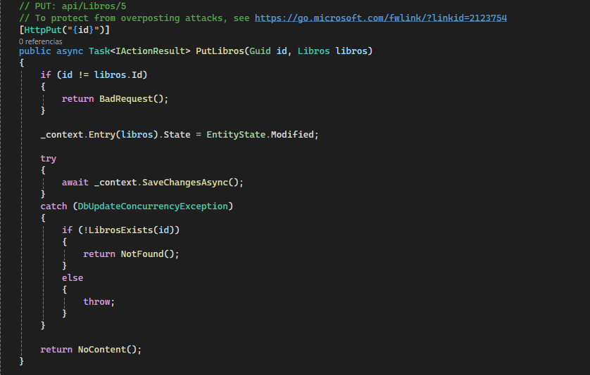

- **Después del manejo de errores:**
  
  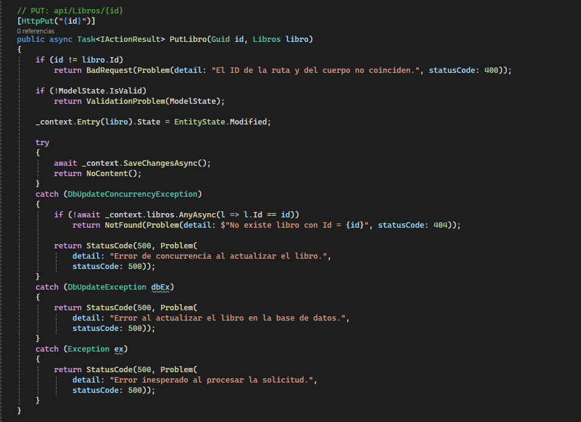

---

### 5. `DELETE {id}` — Eliminar

- **Antes del manejo de errores:**
  
  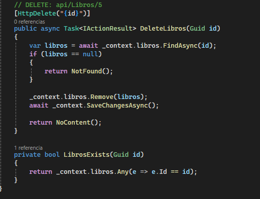

- **Después del manejo de errores:**
  
  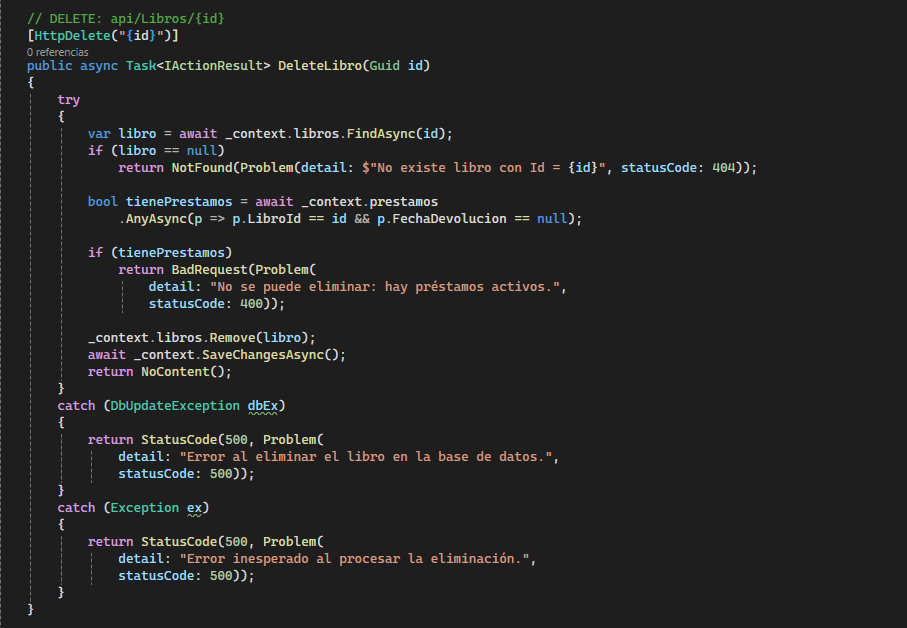

---

## 📂 Comparacion en PrestamosController

### 1. `GET` — Obtener todos

- **Antes del manejo de errores:**
  
  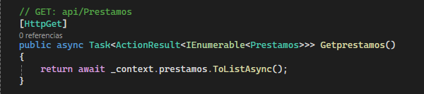

- **Después del manejo de errores:**
  
  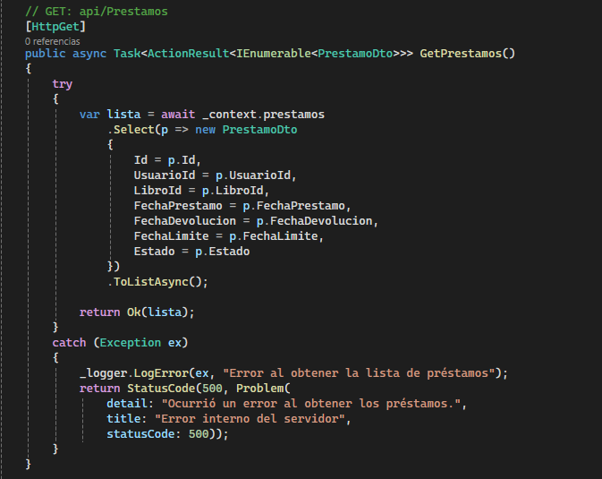

---

### 2. `GET {id}` — Obtener por ID

- **Antes del manejo de errores:**
  
  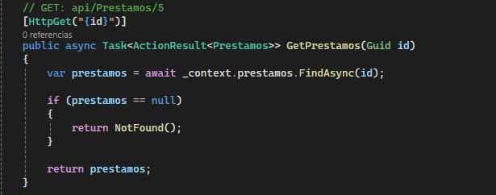

- **Después del manejo de errores:**
  [GetIdPrestamosCorregido](./CodigoCorregido/PrestamosController/GetIdPrestamosCorregido.png)

---

### 3. `POST` — Crear nuevo

- **Antes del manejo de errores:**
  
  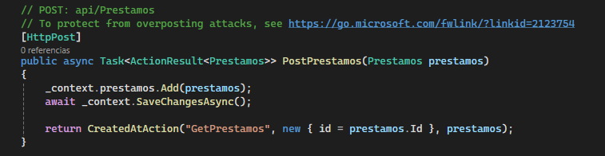

- **Después del manejo de errores:**
  
  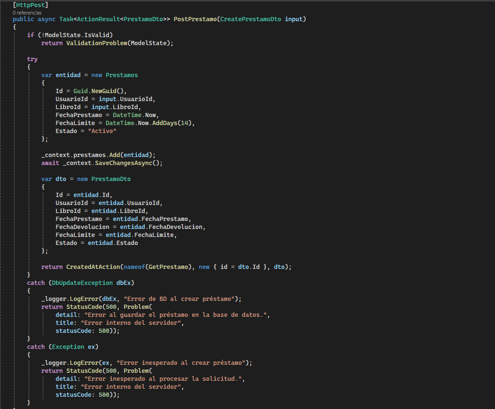

---

### 4. `PUT {id}` — Modificar

- **Antes del manejo de errores:**
  
  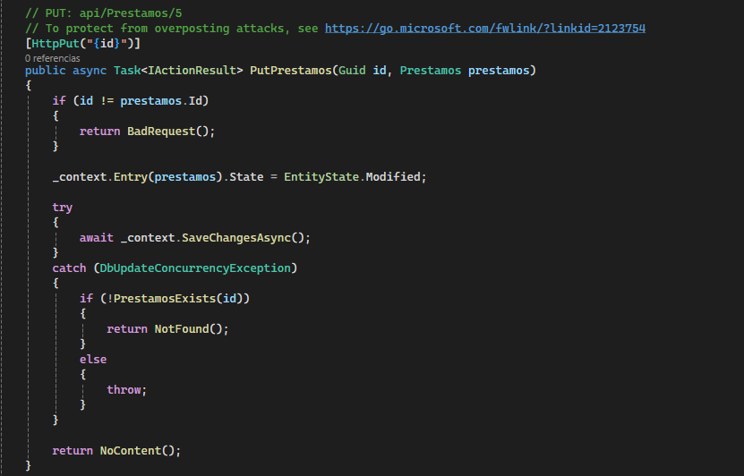

- **Después del manejo de errores:**
  
  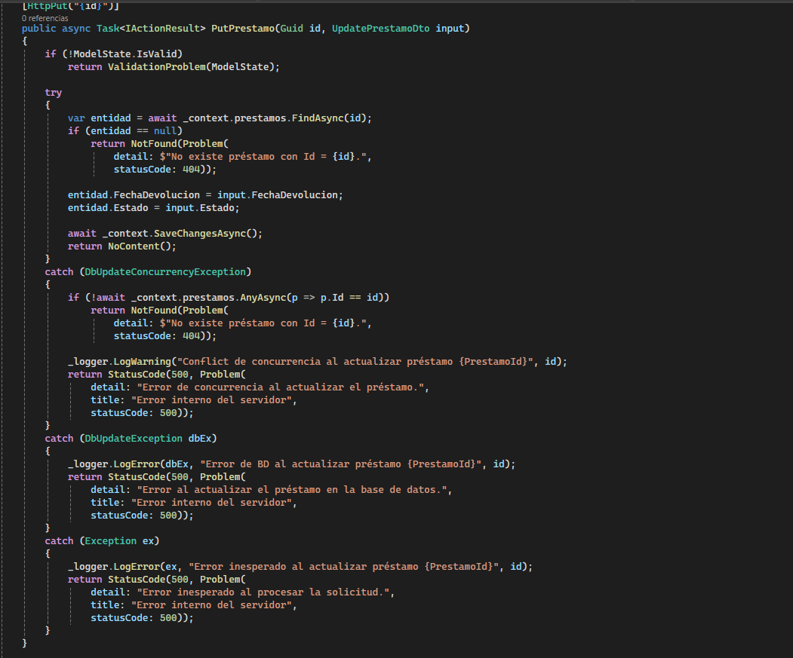

---

### 5. `DELETE {id}` — Eliminar

- **Antes del manejo de errores:**
  
  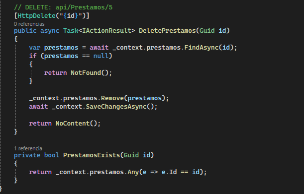

- **Después del manejo de errores:**
  
  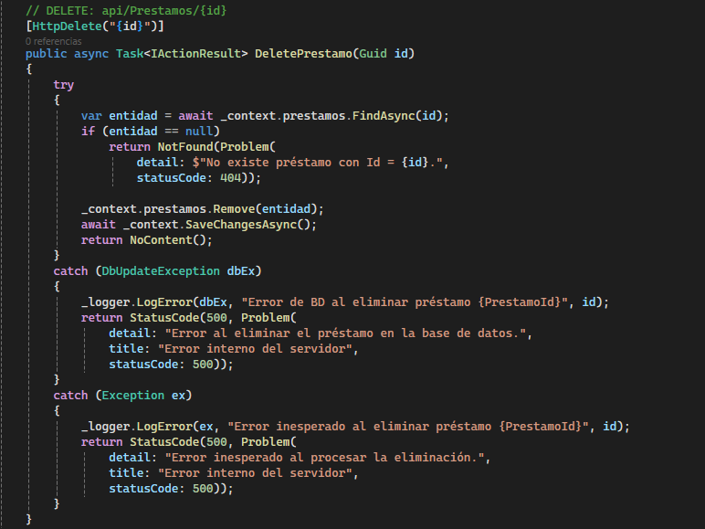

---

## 📂 Comparacion en UsuariosController

### 1. `GET` — Obtener todos

- **Antes del manejo de errores:**
  
  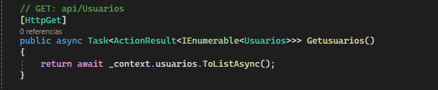

- **Después del manejo de errores:**
  
  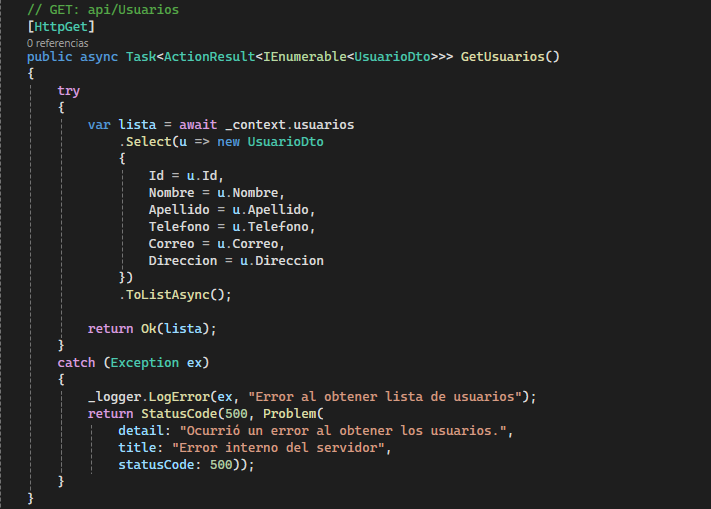

---

### 2. `GET {id}` — Obtener por ID

- **Antes del manejo de errores:**
  
  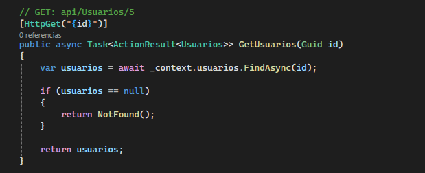

- **Después del manejo de errores:**
  
  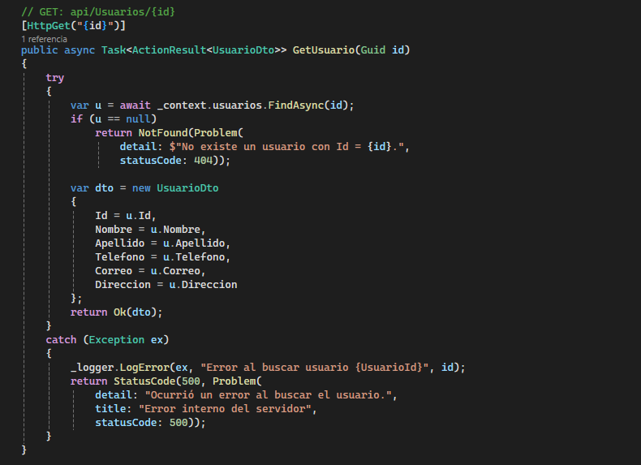

---

### 3. `POST` — Crear nuevo

- **Antes del manejo de errores:**
  
  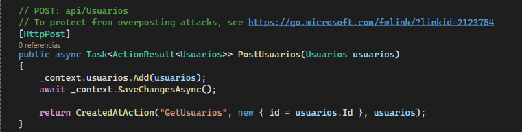

- **Después del manejo de errores:**
  
  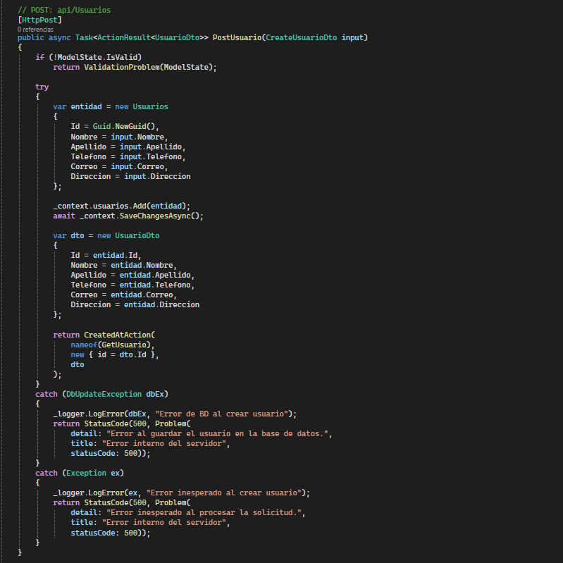

---

### 4. `PUT {id}` — Modificar

- **Antes del manejo de errores:**
  
  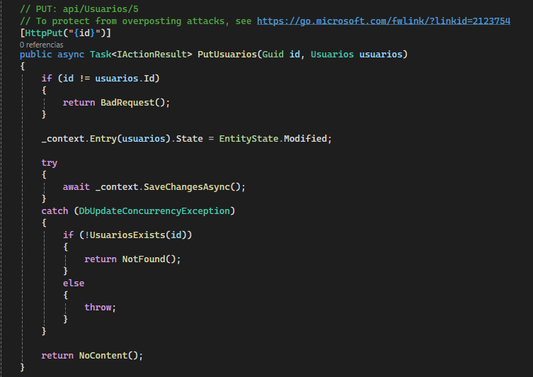

- **Después del manejo de errores:**
  
  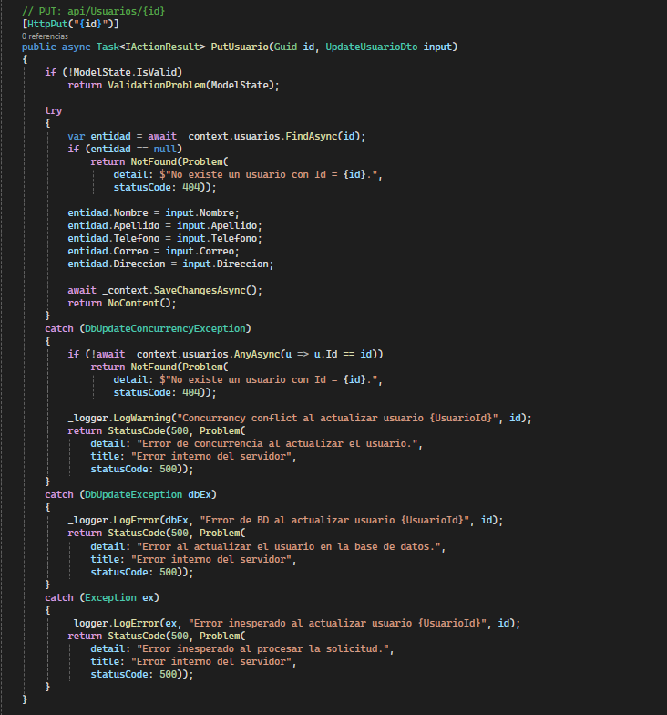

---

### 5. `DELETE {id}` — Eliminar

- **Antes del manejo de errores:**
  
  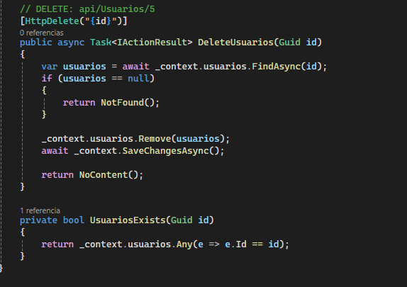

- **Después del manejo de errores:**
  
  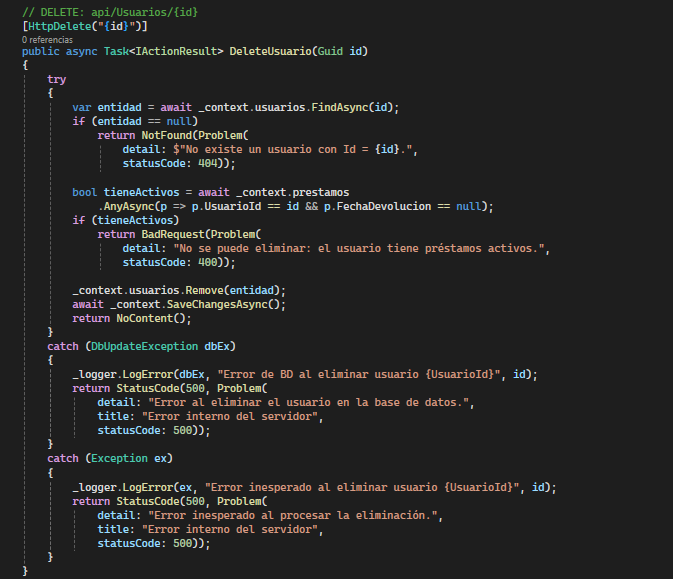

---

## ✅ Conclusión

Gracias al manejo de errores implementado, las consultas dentro de los controllers ahora entregan respuestas más seguras y comprensibles, mejorando tanto la experiencia del desarrollador como la estabilidad del sistema.
